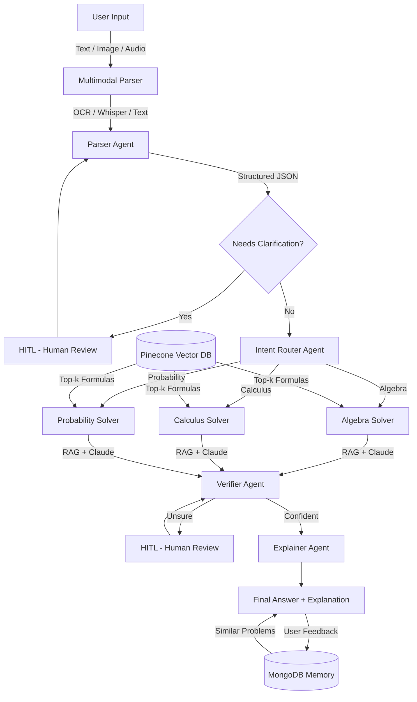

# 📚 IIT JEE Math Mentor
An end-to-end AI application that solves JEE-style math problems, explains solutions step-by-step, and improves over time using RAG + Multi-Agent AI.
## 🚀 Live Demo
👉 [Open App](https://math-mentor-tgt3duelt4kof6ng7pgkp5.streamlit.app/)

## 🎥 Demo Video
👉 [Watch Demo](https://youtu.be/m4vDvJtX5Bc)
## 🏗️ Architecture



## 🤖 Agents

| Agent | Role |
|---|---|
| Parser Agent | Cleans OCR/ASR output, structures problem into JSON, triggers HITL if ambiguous |
| Intent Router | Classifies problem as Algebra / Calculus / Probability and routes workflow |
| Solver Agent | Solves using RAG (retrieved formulas from Pinecone) + Claude LLM |
| Verifier Agent | Checks correctness, domain constraints, edge cases — triggers HITL if unsure |
| Explainer Agent | Produces student-friendly step-by-step explanation with takeaways |

## ✨ Features

- **Multimodal Input** — Text, Image (EasyOCR), Audio (Whisper)
- **RAG Pipeline** — Math formulas & identities stored in Pinecone, retrieved at runtime
- **Multi-Agent System** — 5 specialized agents with LangGraph orchestration
- **Human-in-the-Loop** — Triggers on low OCR confidence, parser ambiguity, verifier uncertainty
- **Memory & Self-Learning** — Solved problems stored in MongoDB, similar past problems shown at runtime
- **Agent Trace** — Full visibility into what each agent did and why

## 🛠️ Tech Stack

- **LLM** — Claude (Anthropic)
- **Agents** — LangGraph
- **RAG** — Pinecone + Google Gemini Embeddings
- **OCR** — EasyOCR
- **ASR** — OpenAI Whisper (local, tiny model)
- **Memory** — MongoDB Atlas
- **UI** — Streamlit

## 🚀 Setup & Run

### 1. Clone the repository
```bash
git clone https://github.com/yourusername/math-mentor.git
cd math-mentor
```

### 2. Create virtual environment
```bash
python -m venv venv
source venv/bin/activate  # Mac/Linux
venv\Scripts\activate     # Windows
```

### 3. Install dependencies
```bash
pip install -r requirements.txt
```

### 4. Set up environment variables
```bash
cp .env.example .env
```
Fill in your API keys in `.env`:
```
ANTHROPIC_API_KEY=your_key
GOOGLE_API_KEY=your_key
PINECONE_API_KEY=your_key
PINECONE_INDEX_NAME=math-mentor
MONGODB_URI=your_mongodb_uri
```

### 5. Ingest math knowledge base into Pinecone
```bash
python formulas.py
```

### 6. Run the app
```bash
streamlit run app.py
```

## 📁 Project Structure

```
ai_planet/
├── app.py            # Streamlit UI
├── classifier.py     # LangGraph multi-agent system
├── memory.py         # MongoDB memory layer
├── formulas.py       # Knowledge base ingestion into Pinecone
├── .env.example      # Environment variable template
└── requirements.txt  # Dependencies
```

## 🔄 How It Works

1. Student inputs a math problem (text, image, or audio)
2. **Parser Agent** cleans and structures the input
3. If ambiguous → **HITL** asks student to clarify
4. **Intent Router** classifies topic and routes to correct solver
5. **Solver Agent** retrieves relevant formulas from Pinecone and solves
6. **Verifier Agent** checks correctness — if unsure → **HITL** for human review
7. **Explainer Agent** generates student-friendly explanation
8. Student gives feedback (✅/❌) → saved to MongoDB memory
9. Next time a similar problem is asked → past solutions shown for reference

## ⚠️ Known Limitations

- Audio transcription uses Whisper `tiny` model — accuracy may vary for heavy accents
- Handwritten OCR accuracy varies — editable text box allows correction
- Audio input may be slow on free-tier cloud deployments
- Scope limited to Algebra, Calculus, and Probability (JEE level)

## 📊 Evaluation Summary

| Criteria | Status |
|---|---|
| Multimodal Input (Text/Image/Audio) | ✅ Implemented |
| Parser Agent with structured output | ✅ Implemented |
| RAG Pipeline (embed → store → retrieve) | ✅ Implemented |
| Multi-Agent System (5+ agents) | ✅ Implemented (5 agents) |
| Human-in-the-Loop | ✅ Implemented (3 trigger points) |
| Memory & Self-Learning | ✅ Implemented |
| Streamlit UI with all required panels | ✅ Implemented |
| Deployment | ✅ Deployed |
